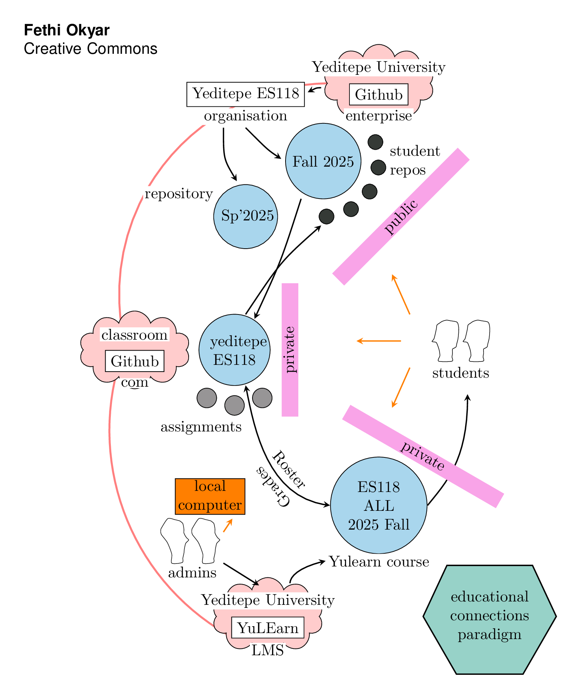
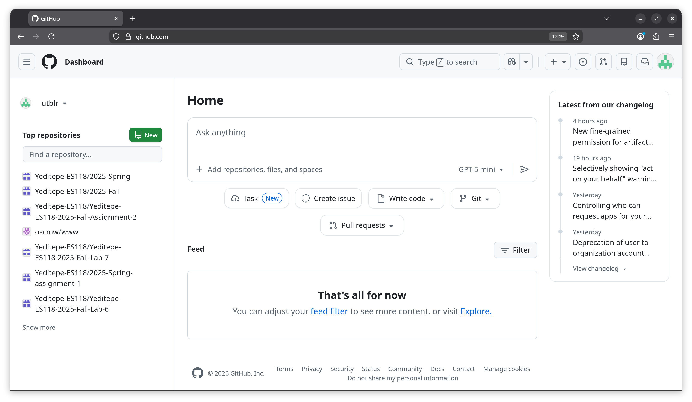
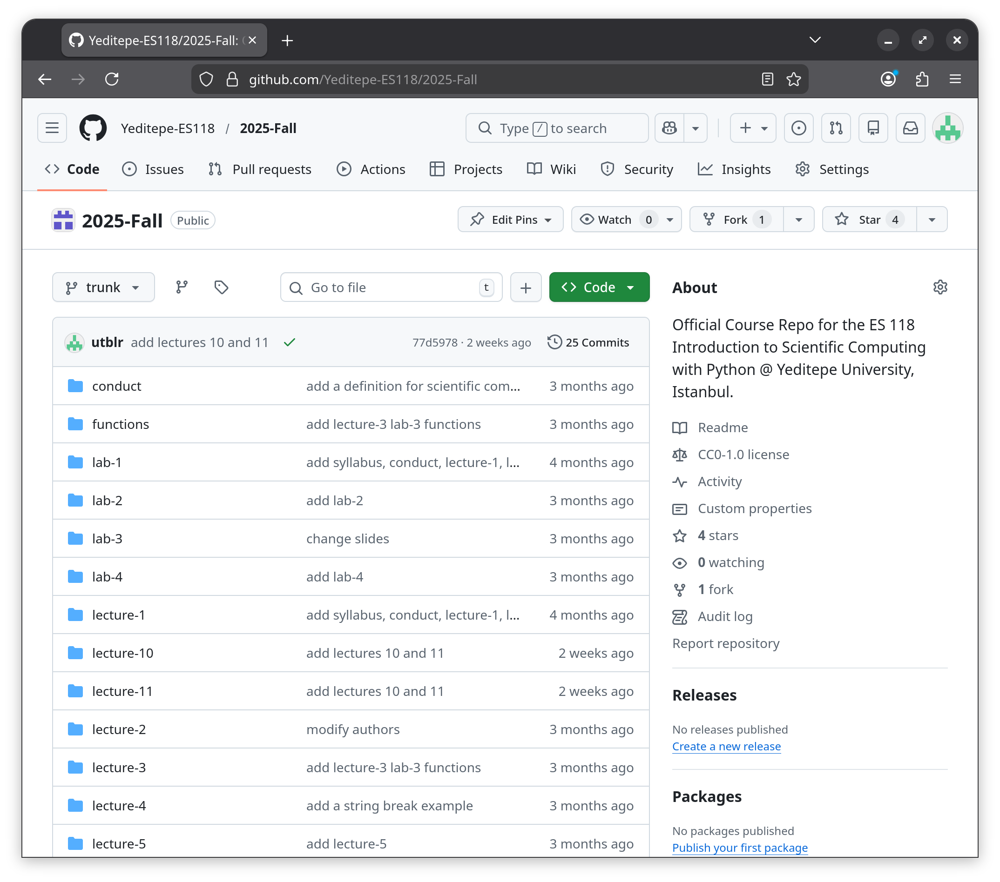
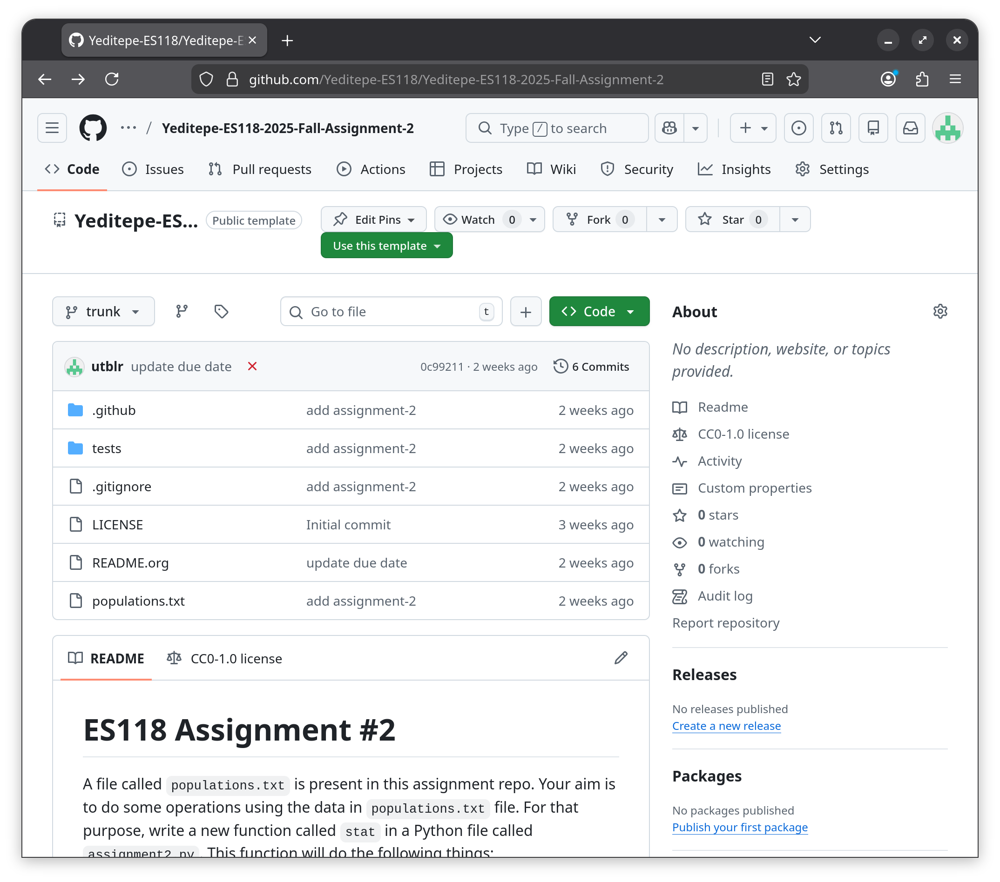
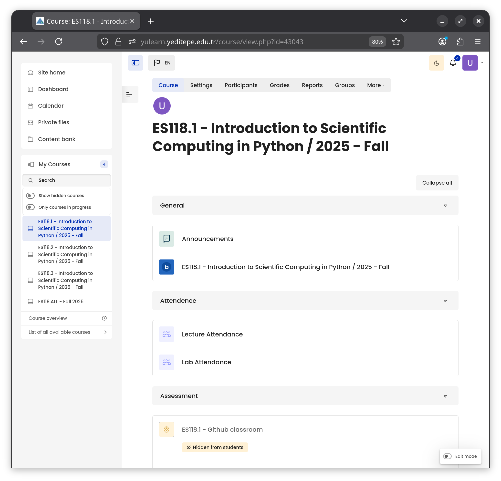
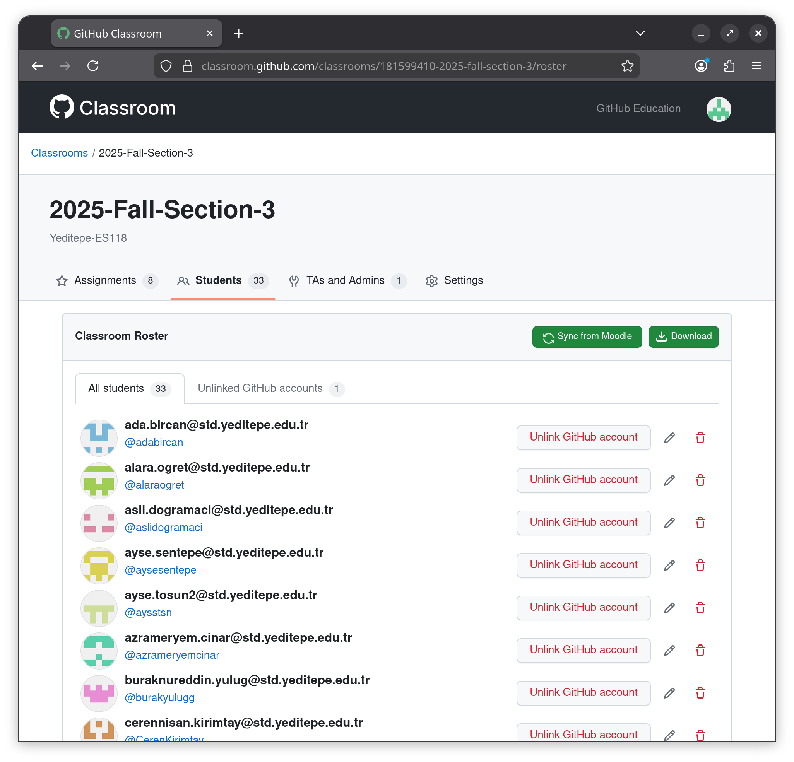
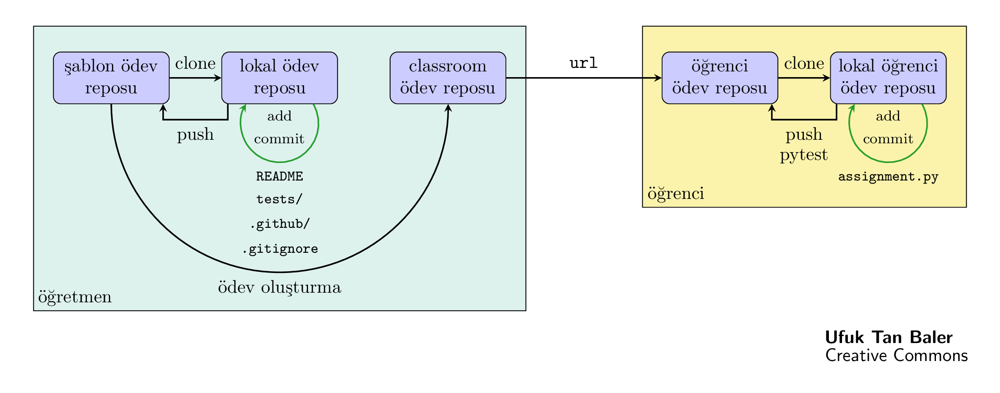
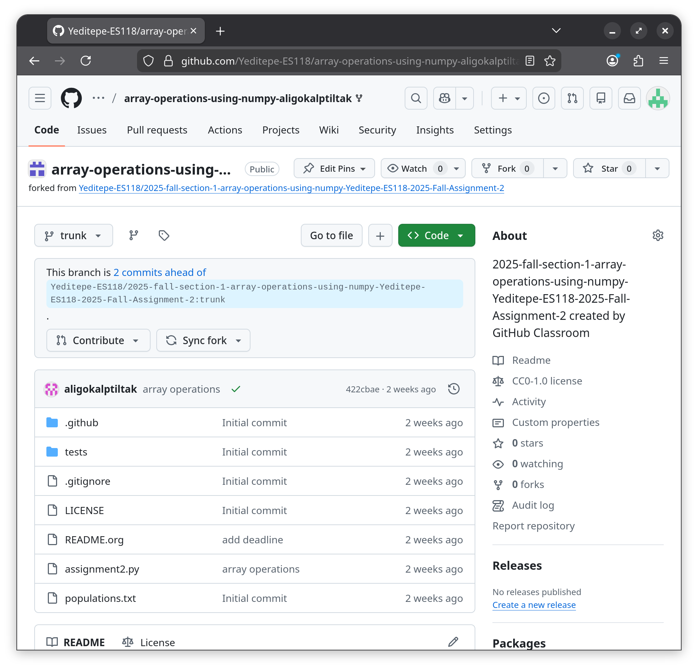
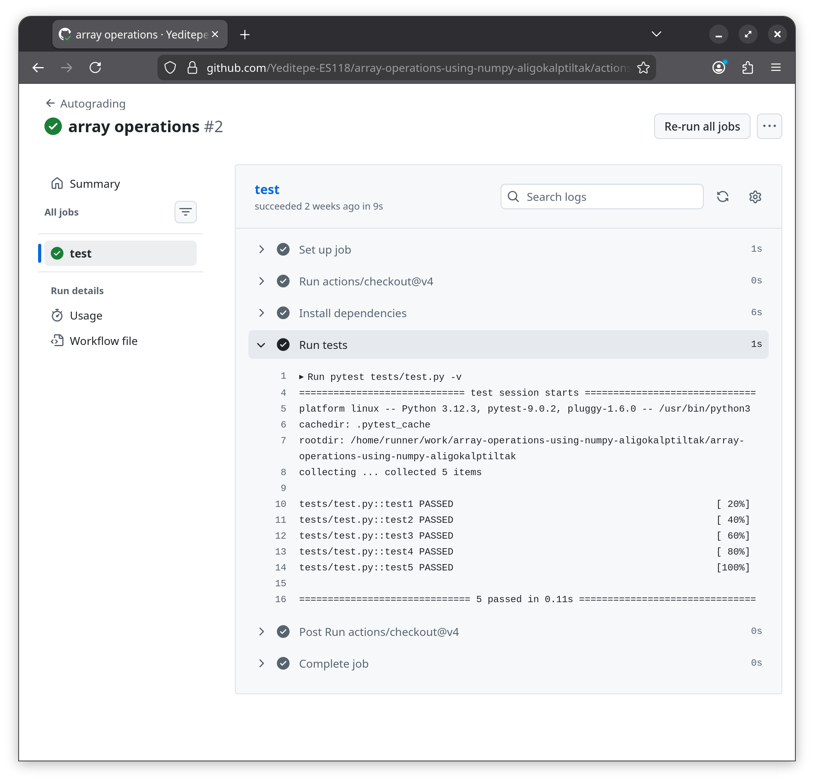

#+TITLE: Öğretimde Github
#+AUTHOR: Ufuk Tan Baler, MSc. & Doç. Dr. Fethi Okyar
#+DATE: 15 Ocak 2026
#+STARTUP: overview
#+REVEAL_THEME: simple
#+REVEAL_INIT_OPTIONS: slideNumber:"c/t", width:1920, height:1080, navigationMode:"linear", transition:"none"
#+REVEAL_TITLE_SLIDE: <h1>%t</h1> <h5>%a</h5> <h6>%d</h6>
#+OPTIONS: timestamp:nil toc:1 num:nil reveal_global_footer:nil
#+REVEAL_EXTRA_CSS: ./style.css
#+LATEX_HEADER: \usepackage{amsmath}
#+MACRO: color @@html:$2@@

* paradigma
#+ATTR_HTML: :width 800px

* sanal ortamlar
** Github
#+ATTR_HTML: :width 1600px

*** ders depoları (repo)
#+REVEAL_HTML: 

dönem ders notları reposu
#+ATTR_HTML: :width 1200px

#+REVEAL_HTML: 

#+REVEAL_HTML: 

şablon ödev reposu
#+ATTR_HTML: :width 1200px

#+REVEAL_HTML: 

#+BEGIN_COMMENT
#+REVEAL_HTML: 

#+ATTR_HTML: :width 1200px
[[./ders-reposu2.png]]
#+REVEAL_HTML: 

#+END_COMMENT

** git
- PC --- Github iletişimi
- ders notlarının güncellenmesi
- farklı platformlarda uyumluluk  

** Github Classroom
#+REVEAL_HTML: 

Yulearn --- Classroom bağlantısı
#+ATTR_HTML: :width 1200px

#+REVEAL_HTML: 

#+REVEAL_HTML: 

Classroom şubesi
#+ATTR_HTML: :width 1200px

#+REVEAL_HTML: 

#+BEGIN_COMMENT
#+REVEAL_HTML: 

#+ATTR_HTML: :width 1200px
[[./ders-reposu2.png]]
#+REVEAL_HTML: 

#+END_COMMENT

* ödev döngüsü
#+ATTR_HTML: :width 1600px

#+BEGIN_COMMENT
1. yeni ödev reposu Github'da yaratılır
2. repo lokal PC'ye git ile clone'lanır
3. lokaldeki repo yeni içerikle güncellenir
4. git ile güncel ödev reposu push'lanır
5. classroom'da yeni ödev yaratılır
6. öğrenciler için bireysel repolar açılır
7. öğrenciler repolarına çalışmalarını push'lar
8. her push için otomatik bir test koşulur
9. öğretmen bitiş süresinden sonra kontrol eder
#+END_COMMENT
   
** ödev repoları
#+REVEAL_HTML: 

öğrenci tarafından push edilmiş ödev reposu
#+ATTR_HTML: :width 1200px

#+REVEAL_HTML: 

#+REVEAL_HTML: 

ödev kontrolü
#+ATTR_HTML: :width 1200px

#+REVEAL_HTML: 

* ödev demosu
#+BEGIN_COMMENT
Classroom oluşturma:
1. go to github classroom
2. create new classroom under Yeditepe-ES118: Yeditepe-ES118-Demo-Classroom
3. add new student via email (ufuktan.baler@std.yeditepe.edu.tr)

Şablon ödev reposu oluşturma:
1. github Yeditepe-ES118 organizasyonuna git
2. yeni bir şablon ödev reposu oluştur: Yeditepe-ES118-Demo-Odev
3. şablon ödev reposunu clone'la
4. içine Templates/assignment'dan tests, .github, .gitignore'u kopyala
5. tests, .github, .gitignore'u anlat
6. şablon ödev reposunu push'la

Classroom github'da ödev reposunu oluştur

URL'i öğrenciye ver

Öğrecinin ödev yapması:
1. github'da oturum açma
2. git bash kurulacak
3. url'den git ile kendi ödev reposunu indirecek
4. ödev yapılıp add, commit, push yapılacak

Öğretmen dashboard'dan kontrol edecek   
#+END_COMMENT

* dönem içi submission oranı
- 103 öğrenci
- %50 submission  
* sonuç, tartışma ve öneriler

